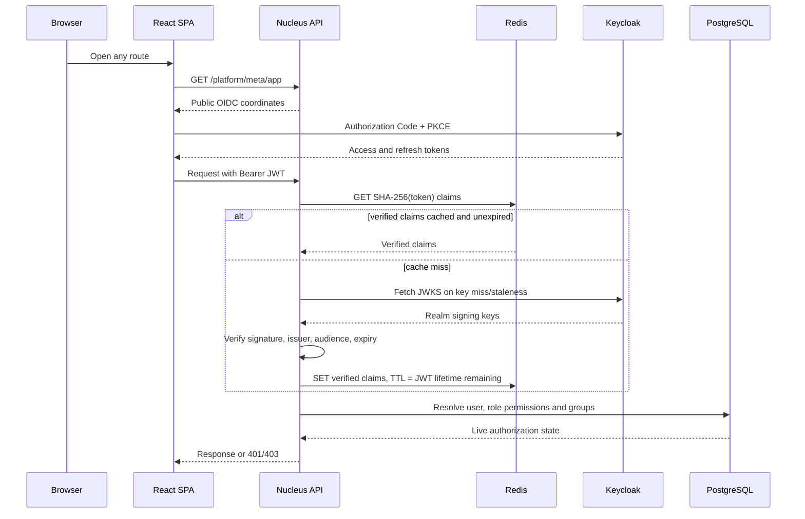

# Role-based access control

Nucleus uses Keycloak for authentication and the application database for
authorization. A Keycloak access token proves who the caller is and names the
realm roles they belong to. The `roles.permissions` PostgreSQL column and the
caller's additive groups decide what that identity may do in Nucleus.

The backend is the enforcement boundary. Frontend route guards and hidden menu
items improve the experience, but they are not security controls; every
protected endpoint must use `@authenticated` or `@requires(...)` from
`backend/src/core/auth.py`.

## Request flow



Important properties:

- The browser obtains OIDC coordinates from `/platform/meta/app`; no Keycloak
  URL, realm or client ID is compiled into the bundle.
- Every protected request carries the access token. The SPA refreshes it when
  fewer than 30 seconds remain.
- Redis keys contain a SHA-256 token digest. Raw bearer tokens are stored in
  neither keys nor values.
- Verified claims are cached for at most `exp - now` seconds. A token with five
  minutes remaining is cached for no more than five minutes.
- Redis is optional. A miss or outage falls back to signature verification.
- The JWKS cache refreshes when stale or when an unknown signing-key ID appears,
  which handles Keycloak key rotation without restarting the API.
- Permission bundles are loaded from PostgreSQL on every request, even when
  claims came from Redis. Editing a role therefore changes authorization on the
  next request without requiring the user to sign in again.

## Identity and role resolution

Realm roles map to platform role codes in `REALM_ROLE_MAP`. If one token carries
several mapped roles, the role with the highest configured rank wins. An
unmapped realm account falls back to `VIEWER`; it does not gain write access.

| Demo sign-in | Realm role | Platform role | Rank | Intended use |
| --- | --- | --- | ---: | --- |
| `admin` | `administrator` | `ADMINISTRATOR` | 100 | Full administration and all operations |
| `manager` | `manager` | `MANAGER` | 80 | Team operations, imports, bulk work and reporting |
| `operator` | `operator` | `OPERATOR` | 60 | Daily records, tasks, mail, files and calendar work |
| `analyst` | `analyst` | `ANALYST` | 50 | Read, search, export, audit and reporting |
| `user` | `viewer` | `VIEWER` | 20 | Read-only day-to-day access |

These accounts and their passwords are local test data from
`keycloak/realm-template.json`; they are not a production account strategy and
the application does not expose an account-switching control.

The local `users` row is matched by Keycloak subject first, then email, then
username. Keycloak remains authoritative for name and email. Suspended, locked
or inactive local users receive 403 even when their Keycloak token is valid.

## Default role matrix

This table documents the defaults in `ROLE_DEFAULTS`. The live source is the
`roles` table, so an administrator may change a deployed role without changing
code. A check means the default role carries the permission; a dash means it
does not.

<!-- generated:permission-matrix -->

| Permission | Administrator | Manager | Operator | Analyst | Viewer |
| --- | --- | --- | --- | --- | --- |
| **Records** |  |  |  |  |  |
| `records.view` — View records | ✓ | ✓ | ✓ | ✓ | ✓ |
| `records.create` — Create records | ✓ | ✓ | ✓ | — | — |
| `records.update` — Update records | ✓ | ✓ | ✓ | — | — |
| `records.delete` — Delete records | ✓ | — | — | — | — |
| `records.comment` — Comment on records | ✓ | ✓ | ✓ | — | — |
| `records.export` — Export records | ✓ | ✓ | ✓ | ✓ | — |
| `records.import` — Import records | ✓ | ✓ | — | — | — |
| `records.bulk` — Run bulk operations | ✓ | ✓ | — | — | — |
| **Administration** |  |  |  |  |  |
| `admin.access` — Open the administration area | ✓ | — | — | — | — |
| `users.view` — View users | ✓ | ✓ | ✓ | ✓ | ✓ |
| `users.manage` — Manage users | ✓ | ✓ | — | — | — |
| `users.impersonate` — Impersonate users | ✓ | — | — | — | — |
| `roles.manage` — Manage roles and permissions | ✓ | — | — | — | — |
| `orgs.manage` — Manage organizations | ✓ | — | — | — | — |
| `settings.manage` — Manage system settings | ✓ | — | — | — | — |
| `announcements.manage` — Write and publish announcements | ✓ | ✓ | — | — | — |
| `automations.manage` — Write and run automations | ✓ | ✓ | — | — | — |
| `flags.manage` — Manage feature flags | ✓ | — | — | — | — |
| `integrations.manage` — Manage integrations | ✓ | — | — | — | — |
| `api.manage` — Manage API credentials | ✓ | — | — | — | — |
| **Operations** |  |  |  |  |  |
| `jobs.view` — View background jobs | ✓ | ✓ | ✓ | ✓ | — |
| `jobs.manage` — Retry and cancel jobs | ✓ | ✓ | — | — | — |
| `logs.view` — View system logs | ✓ | ✓ | — | — | — |
| `audit.view` — View audit logs | ✓ | ✓ | — | ✓ | — |
| `health.view` — View system health | ✓ | ✓ | ✓ | ✓ | ✓ |
| **Workspace** |  |  |  |  |  |
| `tasks.view` — View tasks | ✓ | ✓ | ✓ | ✓ | ✓ |
| `tasks.manage` — Assign and edit tasks | ✓ | ✓ | ✓ | — | — |
| `mail.access` — Use the mailbox | ✓ | ✓ | ✓ | — | ✓ |
| `files.view` — View files | ✓ | ✓ | ✓ | ✓ | ✓ |
| `files.manage` — Upload and organise files | ✓ | ✓ | ✓ | — | — |
| `calendar.view` — View the calendar | ✓ | ✓ | ✓ | ✓ | ✓ |
| `calendar.manage` — Create and edit events | ✓ | ✓ | ✓ | — | — |
| `reports.view` — View reports | ✓ | ✓ | ✓ | ✓ | ✓ |
| `reports.manage` — Build and save reports | ✓ | ✓ | — | ✓ | — |
| `dashboards.manage` — Customise dashboards | ✓ | ✓ | ✓ | ✓ | — |
| `searches.share` — Share saved searches and views | ✓ | ✓ | — | ✓ | — |

*36 permissions across 4 areas, generated from `backend/src/core/auth.py` by `scripts/render-rbac-matrix.py`.*

<!-- /generated:permission-matrix -->

## Groups

Groups grant additive permissions independently of the primary role. For
example, placing an operator in an on-call group can grant `jobs.manage`
without promoting that person to Manager. Group permissions are unioned with
role permissions; groups cannot subtract a role permission.

Use a role for a person's stable job function and a group for an additional,
usually narrower responsibility. Avoid groups that recreate an entire role,
because duplicated permission bundles drift.

## Endpoint enforcement

Use the narrowest permission that describes the operation:

```python
from src.core.auth import me, requires


@requires("records.view")
def list_projects(app=None, operation="", request=None, **_):
    principal = me()
    # Queries may additionally scope rows by principal.organization_id.
    ...


@requires("records.update", "records.bulk")
def bulk_update_projects(app=None, operation="", request=None, **_):
    ...
```

`@requires()` with no arguments means authenticated-only. Public endpoints
should be deliberately unguarded or use `@optional` when they can enrich a
response for a signed-in caller. A 403 response names missing permissions and
their human labels; a missing or unusable token produces 401.

Row-level rules remain necessary. A permission such as `records.update` says
the operation is allowed in principle; organization ownership, resource
sharing, assignment or other row scope must still be included in the SQL query.
Never fetch broad data and filter it in the browser.

### Where ownership overrides a permission entirely

Two places check *who* rather than only *what*, and both are deliberate.

**An export's file belongs to whoever requested it** (§30). `records.export`
lets somebody produce an export; it does not let them fetch another person's.
`/exports` lists your own, and `GET /exports/<id>/download` checks
`initiated_by_id` — **including for an administrator**. An export is a copy of
whatever rows its requester could see, filtered however they filtered them, so
a link to it is a link to those rows; an administrator who needs the data runs
the query themselves, which leaves an audit entry in their own name that a
download of somebody else's row would not. The refusal is 404 and not 403,
because "that belongs to somebody else" confirms a reference exists. Job
*metadata* stays visible to `jobs.view` on `/admin/jobs` — a queue console that
cannot see its own queue is useless — but the artefact does not.

**A staged import belongs to whoever uploaded it** (§29), for exactly the
export's reason turned around: an `ImportRun` holds the *contents of somebody's
spreadsheet* in `staged_rows` — names, emails, whatever was in it — until the
rows become records or the run is discarded. So `/import` lists your own,
`GET /imports/<id>` checks `created_by_id` including for an administrator, and
the refusal is 404. `records.import` is also deliberately narrower than
`records.create`: creating one record is a form somebody filled in and can see,
while importing five thousand is an act nobody reads row by row.

**An automation rule belongs to its author** (§49): holding
`automations.manage` does not permit editing a colleague's rule. Here
`admin.access` *is* an exception, because somebody has to be able to stop a
rule whose author has left — the difference from exports and imports is that
stopping a rule is a containment action, while reading a file is a disclosure.

## Frontend behavior

`AuthProvider` loads `/api/me` and exposes `can(permission)`. The application
shell and command palette omit destinations the caller cannot use. A direct
link to a known but forbidden route renders a 403 explanation. This behavior
is useful, but the backend decorator remains mandatory because browser state
can be changed by the caller.

The production frontend contains no mock role matrix or permission fallback.
Test fixtures under `frontend/src/test/` simulate HTTP
responses for isolated component tests only and are excluded from the runtime
module graph. Playwright tests exercise the real Keycloak, API and database.

## Impersonation

An administrator with `users.impersonate` may send `X-Impersonate-User` with a
user UUID or email. The backend resolves the target's live permissions and
keeps the original administrator identity as `impersonator_id` and
`impersonator_label`. Audit rows for an impersonated action must record both
identities. A caller without `users.impersonate` cannot activate impersonation.

## Adding or changing a permission

1. Add the code and label to `PERMISSION_GROUPS` in
   `backend/src/core/auth.py`.
2. Add it to the intended defaults in `ROLE_DEFAULTS`.
3. Update the seeded/live `roles.permissions` values through a migration or
   role-management operation; changing defaults alone does not rewrite an
   existing database.
4. Guard each backend operation with `@requires("new.permission")` and add 401
   and 403 integration cases.
5. Put the same permission code on relevant frontend navigation or actions.
6. Update the matrix in this document and test at least one allowed and one
   denied persona through the real stack.

## Verification

Relevant automated coverage:

- `backend/tests/test_auth.py` — verified-claim cache hit/miss, expiry, digest
  isolation and raw-token secrecy.
- `backend/tests/test_me.py` — 401, inactive-profile 403, live database role
  changes, profile shape and preference validation.
- `frontend/src/auth/AuthProvider.test.tsx` — permission hook behavior at the
  HTTP boundary.
- `frontend/src/app/AppShell.test.tsx` — hidden forbidden navigation and direct
  deep-link denial.
- `backend/tests/test_exports.py` and `test_imports.py` — the ownership rules
  above, each asserted as a 404 for an administrator against another persona's
  row, plus a 403 for a role holding neither privilege.
- `frontend/e2e/` — real Keycloak sign-in and persona-level journeys.
